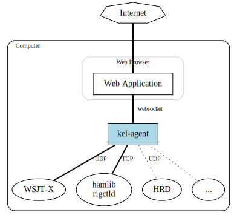

#  kel-agent

An agent program for translating between various amateur radio installed programs and WebSockets.
This was built to support https://github.com/k0swe/forester but can be used by any web application
that needs to communicate with amateur radio installed programs.

This currently supports communication with WSJT-X. Planned support includes `rigctld` and Ham Radio
Deluxe for transceiver remote control.

To get started using `kel-agent`, download an appropriate executable from the
[latest release](https://github.com/k0swe/kel-agent/releases/latest). Windows, Mac, Debian/Ubuntu
Linux and Raspberry Pi installers are available.

See the [Running documentation](RUNNING.md) for how to configure, execute and serve `kel-agent`.

## Acknowledgements

The wire logo for `kel-agent` was created by [Freepik](https://www.flaticon.com/authors/freepik) on
[Flaticon](https://www.flaticon.com).
