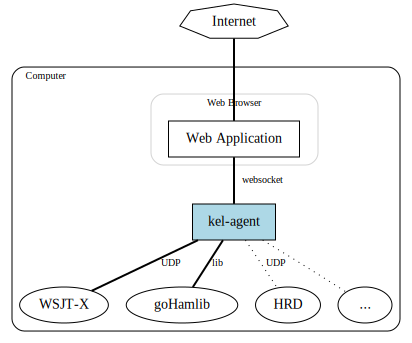

# k0s-agent

An agent program for translating between various amateur radio installed programs and WebSockets.
This will allow the creation of cloud-based amateur radio applications while using integration
points only available through local processes. 

At first this will support receiving status and log messages from WSJT-X. Planned support includes
`rigctld` and Ham Radio Deluxe for transceiver remote control.
